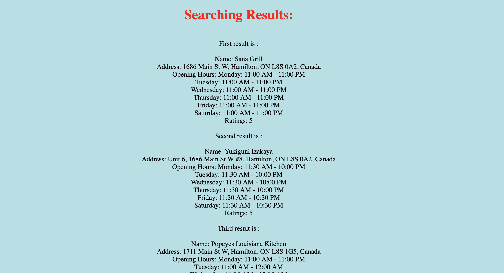

# SmartFinder
It's an webapp built in Maven Java. It uses Google Places API and Geocoding API to help you find the informations of the places that surround you.
First you need to choose a type of places you want to find, such as bar, cafe, park, hospital and so on.

Next, you input your address, it can be a rough address. 

Then, the top three placess which are ranked by distance will pop out.(It includes address, opening hours and the rating.

